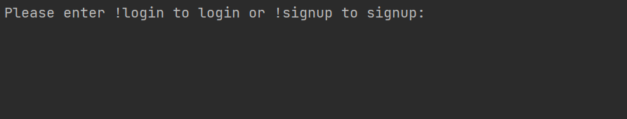
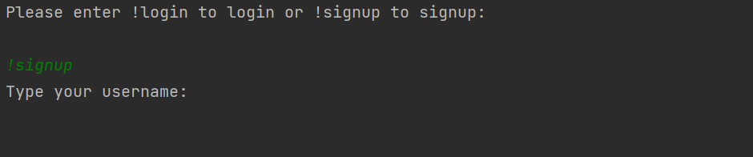
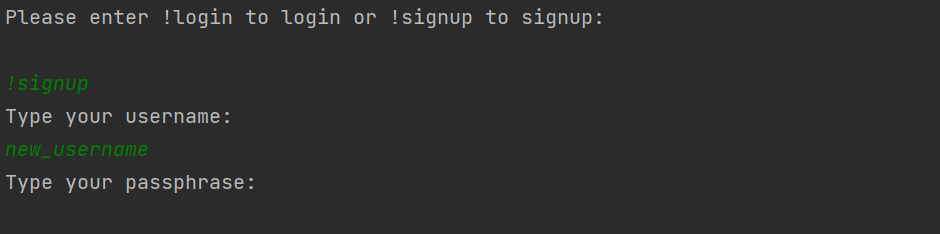
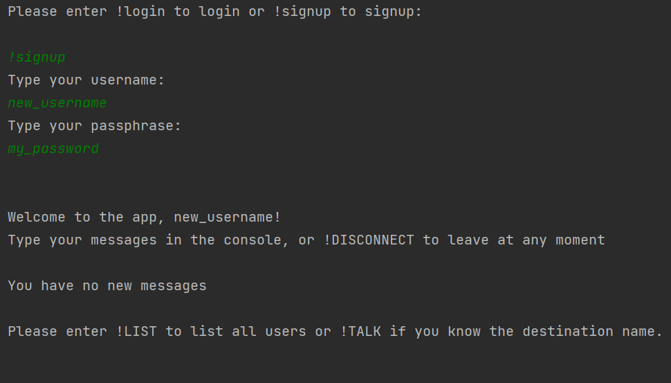
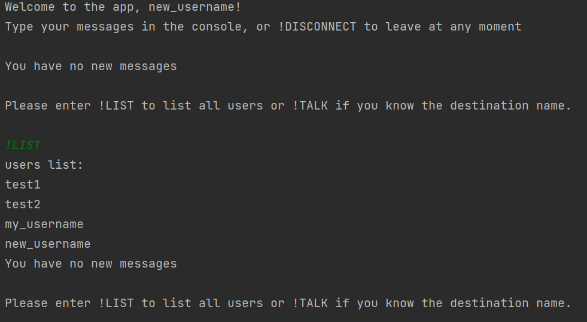
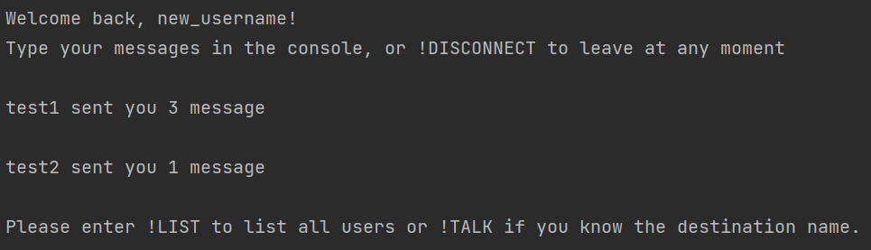
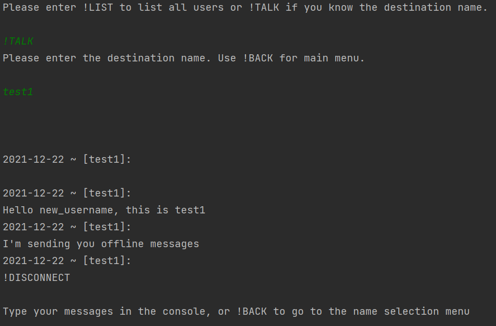
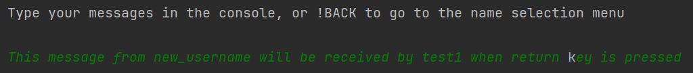
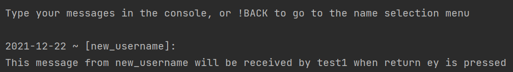

# ELEC-H417-Project_pyChat
## Basic description of the project
This project enable encrypted conversations between two users. The architecture relies on a client/server approach where the server is agnostic to the content of the messages send between users.  
## Report
https://www.overleaf.com/8771966626yrrznqcxhjmc
..

##Software : dependencies

The following dependencies are required : 
- *tinydb* : a lightweight database management system
- *pyaes* : a library dedicated to AES cryptography
- *bcrypt* : a library dedicated to bcrypt hashing 
- *rsa* : a library dedicated to RSA cryptography 
- *openssl* : a library dedicated to SSL connections (used in the secure link between the client and the server)

To install the dependencies, the command *&pip install* **[dependency_name]** can by used. The current project was working properly in pyCharm IDE using the Python 3.8 interpreter. 

##How to use the project

Using the command *git clone *[repository_address]** should allows to create a local copy of the repository. The server needs to be launched prior to the client: this can be done using the Windows command prompt or any terminal window with a properly configured python environment. 

- The server is launched with the python script **/src/server/server.py** 
- The client is launched with the python script **/src/client/client.py**

The parameters used for the connection between the server and the clients are given internally (i.e in the code). At this point, any client/server will use the **localhost** address. Those parameters can be changed by altering the value of the constants from the files */src/server/constants.py* and */src/client/constants.py*.

The data structure of the project should allows to launch both client/server scripts on distinct machines. 

##Features

### SIGNUP screen
When launching the script */src/client/client.py* for the first time, the user can create an account using the command **!signup**. The user is then asks to enter new credentials. Note that if the user choose an already existing username, the signup process fail and the user is send back to a *login/signup* menu.

When the signup process succeed, the user is prompted with the main menu. 

The login process is almost identical to the signup process. Again, the user needs to enter a correct credential pair to be authenticated. If the credential pair is not correct, the user is send back to a *login/signup* menu.

### Main menu
After a successful authentication, the user is able to ask the server for the list of the users known from the database. This list is printed with the command **!LIST**.

The command **!TALK** followed by *username* allows to start a chat session with *username*. When entering a conversation, the content of the message between the client and the server is encrypted by the client. 

### Offline chat session
When *username1* send messages to *username2*, *username2* doesn't need to be available (i.e connected to the server) to receive the messages from *username1*. Moreover, when *username2* will connect to the server, his client will print the number of unread messages as well as the names of the corresponding usernames:

When the user start the chat session, the previous messages are printed on his screen. At any time, the user can go to the previous menu to choose another user to talk with by using the **!BACK** command. Note that the very first message of any conversation in the database is an empty string.

### Online chat session
If both users are connected to the server and if they are communicating with each other at the same time, the new messages can be printed on the users screens without any input from them (i.e the client chat screen is updated by the server when the peer send his message). 

